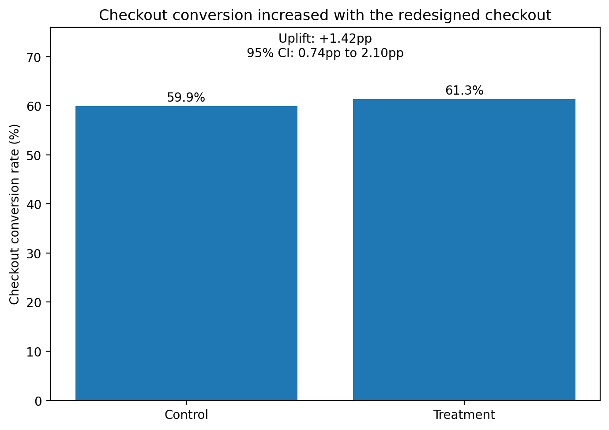

# Project 02: Checkout Conversion Experiment

## Overview

This is a synthetic A/B test built around a straightforward product decision: should a redesigned checkout replace the existing one?

I used SQL to validate and reshape the experiment data, then Python to run the statistical analysis and create the visualisations. The decision is based on checkout conversion, revenue per checkout user and technical payment-error rate.

## Live project

[View the published analysis on GitHub Pages](https://jsklair.github.io/project_02_checkout_ab_test_analysis/)

## Key result

The redesigned checkout increased conversion from **59.90% to 61.32%**.

- **Absolute conversion uplift:** +1.42 percentage points
- **Relative uplift:** +2.37%
- **95% CI:** +0.74pp to +2.10pp
- **Two-sided p-value:** 0.000040

Revenue per checkout user increased from **£46.65 to £48.89**, an observed uplift of **£2.24 per user**.

The technical payment-error rate increased by **0.22 percentage points**, but remained below the pre-agreed **+0.5 percentage-point investigation threshold**.

**Recommendation: roll out the redesigned checkout while continuing to monitor technical payment errors.**



## Analysis approach

I first validated the experiment setup and raw event data in SQL, including allocation checks, duplicate handling and experiment-window filtering. I then built a one-row-per-user analysis view for the main experiment metrics.

Python was used for the statistical testing: sample ratio mismatch, conversion uplift, revenue per checkout user, the technical payment-error guardrail and the pre-planned device comparison. The final step was to bring those results together into a rollout recommendation.

## Dataset

The synthetic dataset contains four related tables:

| Table | Description |
|---|---|
| `users` | User characteristics including device and acquisition channel |
| `experiment_assignments` | Persistent control/treatment assignment |
| `events` | Checkout, payment and purchase events |
| `orders` | Completed orders and revenue |

The experiment contains **80,000 users**, split equally between control and treatment.

I deliberately included a few data-quality problems so the analysis would have to deal with the kinds of issues that turn up in real event data rather than starting from a perfectly clean dataset.

These include:

- duplicate events
- events outside the experiment window
- missing acquisition-channel values

## Experiment metrics

### Primary metric

**Checkout conversion rate**

Completed purchasers divided by users entering checkout.

### Commercial secondary metric

**Revenue per checkout user**

Total completed-order revenue divided by experiment users entering checkout.

### Guardrail

**Technical payment-error rate**

Users experiencing at least one technical payment error divided by users who submitted payment.

A treatment increase of more than **0.5 percentage points** was pre-agreed as the investigation threshold.

## Results

| Metric | Control | Treatment | Difference |
|---|---:|---:|---:|
| Conversion rate | 59.895% | 61.315% | +1.420pp |
| Revenue per checkout user | £46.65 | £48.89 | +£2.24 |
| Technical payment-error rate | 2.081% | 2.298% | +0.217pp |

The 95% confidence interval for the conversion uplift was **+0.743pp to +2.097pp**, providing strong evidence of a positive treatment effect.

The treatment effect was also positive across both desktop and mobile users.


## Repository structure

```text
data/
  synthetic/       Synthetic source CSV files
docs/
  assets/          Images used by the GitHub Pages site
  index.md         Published project landing page
python/
  generate_synthetic_data.py
  build_database.py
  run_sql.py
  analyse_experiment.py
  create_visualisations.py
sql/
  01_data_validation.sql
  02_create_analysis_views.sql
  03_experiment_metrics.sql
reports/
  synthetic_data_specification.md
  experiment_results.md
visuals/
  01_checkout_conversion.png
  02_revenue_per_checkout_user.png
  03_device_conversion_uplift.png
  04_technical_error_guardrail.png
requirements.txt
README.md
project_plan.md
```

The generated SQLite database is deliberately excluded from version control. It can be recreated locally from the supplied CSV files.

## Reproducing the analysis

Install the Python dependencies:

```powershell
python -m pip install -r requirements.txt
```

Generate or regenerate the synthetic source data:

```powershell
python python\generate_synthetic_data.py
```

Build the local SQLite database:

```powershell
python python\build_database.py
```

Run the initial SQL validation:

```powershell
python python\run_sql.py sql\01_data_validation.sql
```

Create and validate the analysis views:

```powershell
python python\run_sql.py sql\02_create_analysis_views.sql
```

Calculate the core experiment metrics:

```powershell
python python\run_sql.py sql\03_experiment_metrics.sql
```

Run the statistical analysis:

```powershell
python python\analyse_experiment.py
```

Create the visualisations:

```powershell
python python\create_visualisations.py
```

## Tools

- Python
- pandas
- NumPy
- SciPy
- Matplotlib
- SQL
- SQLite
- Git
- GitHub
- GitHub Pages

## Further detail

See [the full experiment results](reports/experiment_results.md) for the statistical interpretation, guardrail assessment, subgroup analysis and rollout recommendation.

The underlying experiment design and synthetic-data assumptions are documented in [the synthetic data specification](reports/synthetic_data_specification.md).

## Project status

**Complete.**

The dataset is synthetic and is intended to demonstrate a realistic product-analytics and experimentation workflow rather than represent results from a real company.