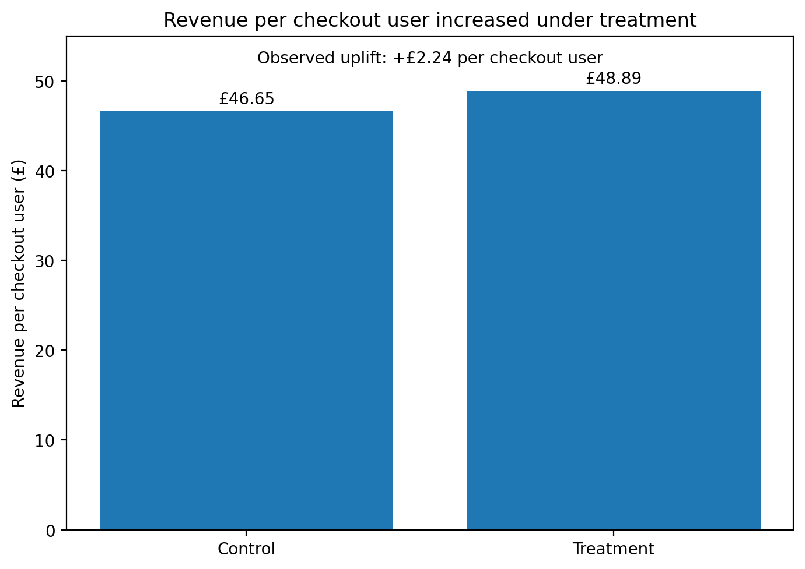
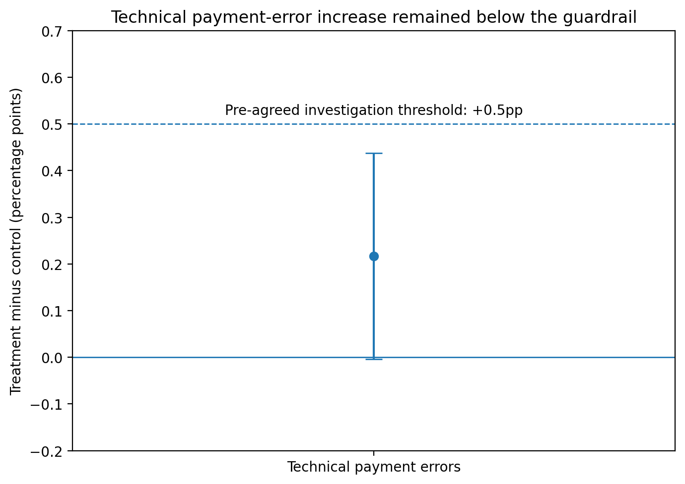
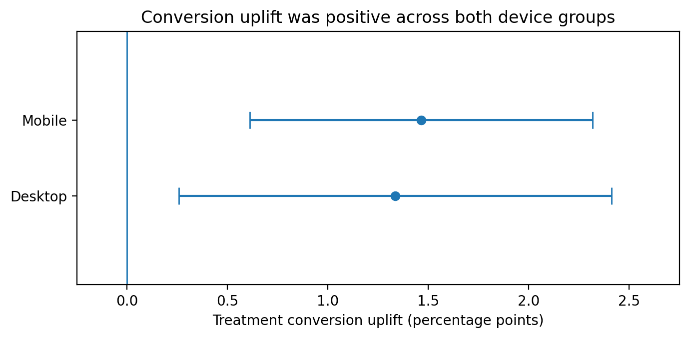

# Checkout Conversion Experiment

## Evaluating an A/B test of a streamlined online checkout

This analysis asks whether a streamlined checkout should replace the existing version. The experiment is synthetic, but it is structured around the same decision an analyst would face in a live product test.

SQL is used to validate the experiment data and build the user-level metrics; Python handles the statistical testing and visualisations.

---

## Executive summary

The redesigned checkout increased conversion from **59.90% to 61.32%**.

That represents:

- **+1.42 percentage points** absolute conversion uplift
- **+2.37%** relative conversion uplift
- **95% confidence interval:** +0.74pp to +2.10pp
- **two-sided p-value:** 0.000040

Revenue per checkout user also increased from **£46.65 to £48.89**, an observed improvement of **£2.24 per user**.

The technical payment-error rate increased slightly, but remained below the pre-agreed investigation threshold.

**Recommendation: roll out the redesigned checkout while continuing to monitor technical payment errors.**

---

## Primary outcome: checkout conversion

| Metric | Control | Treatment |
|---|---:|---:|
| Checkout users | 40,000 | 40,000 |
| Converted users | 23,958 | 24,526 |
| Conversion rate | 59.895% | 61.315% |

The estimated treatment effect was **+1.420 percentage points**.

The 95% confidence interval ranged from **+0.743pp to +2.097pp**, providing strong evidence that the redesigned checkout improved conversion.

The observed effect exceeded the experiment's planned 1 percentage-point minimum detectable effect. However, because the lower confidence bound is below 1pp, the analysis does not establish with 95% confidence that the true uplift itself is at least 1 percentage point.

---

## Commercial impact

| Metric | Control | Treatment |
|---|---:|---:|
| Orders | 25,134 | 25,774 |
| Total revenue | £1,866,119.39 | £1,955,701.89 |
| Revenue per checkout user | £46.65 | £48.89 |

Revenue per checkout user increased by **£2.24**.

The 95% confidence interval for this difference was **£1.41 to £3.06**, with a two-sided p-value below 0.000001.

Across the 40,000 users assigned to treatment, the observed revenue-per-user difference corresponds to approximately **£89,600 of additional revenue** relative to the control rate.

---

## Technical payment-error guardrail

Technical payment errors were measured among users who submitted payment.

| Metric | Control | Treatment |
|---|---:|---:|
| Payment submitters | 33,741 | 33,773 |
| Users with technical error | 702 | 776 |
| Technical error rate | 2.081% | 2.298% |

The estimated increase was **+0.217 percentage points**.

The 95% confidence interval ranged from **-0.004pp to +0.438pp**.

The experiment had a pre-agreed investigation threshold of **+0.5 percentage points**. Both the point estimate and the upper end of the confidence interval remained below that level.

The direction of the result still supports continued monitoring following rollout.

---

## Device analysis

The treatment effect was positive across both pre-planned device groups.

| Device | Control conversion | Treatment conversion | Uplift |
|---|---:|---:|---:|
| Desktop | 68.950% | 70.286% | +1.336pp |
| Mobile | 55.019% | 56.485% | +1.465pp |

The positive direction across both groups provides reassurance that the overall result is not being driven entirely by a single device type.

These subgroup results are treated as consistency checks rather than separate primary experiments.

---

## Experiment design

The synthetic experiment contains **80,000 users**, assigned equally between:

- **Control:** existing checkout
- **Treatment:** redesigned checkout

Assignment was persistent at user level and stratified by device.

The experiment ran for **14 days**, from 6 July to 19 July 2026.

### Primary metric

**Checkout conversion rate**

Users completing a purchase divided by users entering checkout.

### Commercial secondary metric

**Revenue per checkout user**

Total completed-order revenue divided by checkout users.

### Guardrail

**Technical payment-error rate**

Users experiencing at least one technical payment error divided by users who submitted payment.

The statistical design used:

- 5% significance level
- 80% statistical power
- two-sided testing
- 1 percentage-point minimum detectable effect
- fixed experiment duration

---

## Data validation

The project uses four synthetic relational tables:

- `users`
- `experiment_assignments`
- `events`
- `orders`

The dataset deliberately contains realistic quality issues so that validation and cleaning form part of the analysis.

SQL checks identified:

- **1,059 duplicate event rows**
- **2,128 out-of-period events**
- **1,529 missing acquisition-channel values**

No orphaned user IDs were found.

After cleaning, the dataset contained **211,733 valid events**.

Deduplicated purchase events reconciled exactly to the orders table:

- purchase events: **50,908**
- orders: **50,908**
- difference: **0**

A sample-ratio-mismatch check also found no evidence of an assignment problem.

---

## Analysis workflow

The raw tables were first checked in SQL for allocation problems, duplicates, out-of-period activity and broken relationships between users, events and orders. After cleaning, I created a user-level analysis view containing the experiment assignment, conversion outcome, order value and payment-error indicators needed for the test.

I then used Python to run the allocation check and statistical comparisons, before bringing the conversion, revenue, guardrail and device results together into the rollout decision.

---

## Recommendation

### Roll out the redesigned checkout

Conversion improved convincingly, and the revenue result moved in the same direction. The increase in technical payment errors was smaller than the pre-agreed investigation threshold, so it does not outweigh the commercial evidence in favour of rollout.

I would still monitor the payment-error rate after release because treatment was directionally higher than control.

---

## Tools used

- Python
- pandas
- NumPy
- SciPy
- Matplotlib
- SQL
- SQLite
- Git
- GitHub
- GitHub Pages

---

## Project files

The full repository includes:

- synthetic source data
- data-generation code
- SQLite database build script
- SQL validation and analysis queries
- Python statistical analysis
- reproducible visualisations
- detailed experiment results
- synthetic-data specification

[View the full project repository on GitHub](https://github.com/jsklair/project_02_checkout_ab_test_analysis)

[Read the detailed experiment results](https://github.com/jsklair/project_02_checkout_ab_test_analysis/blob/main/reports/experiment_results.md)

---

## Data note

This project uses **synthetic data** designed to represent a realistic digital-commerce experiment.

The results demonstrate the analytical process and decision-making approach and should not be interpreted as findings from a real company.